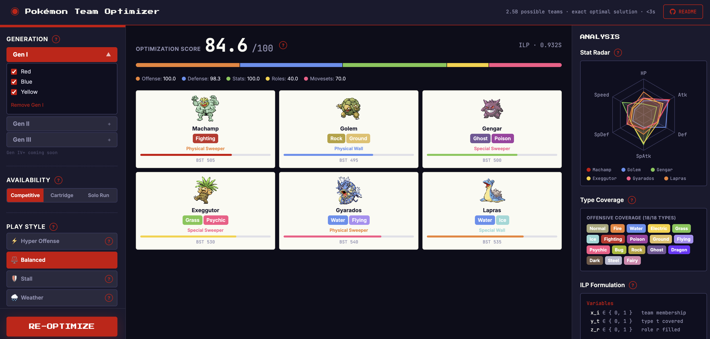

# Pokémon Team Optimizer


**Selects the optimal Pokémon team of 6 using Integer Linear Programming — guaranteed globally optimal, not a heuristic.**

> Picks from Gen I–III (495 Pokémon, C(495,6) ≈ 2.5 billion possible teams) in under 3 seconds.



---

I studied Operations Research in college and became fascinated by how mathematical optimization can be applied to nearly any decision-making problem — portfolio management, transportation routing, workforce scheduling, supply chain allocation. The underlying techniques are the same; only the domain changes.

This project applies one of those techniques — **Integer Linear Programming (ILP)** — to a problem everyone in my life suddenly cared about: building a great Pokémon team. Nintendo re-released FireRed and LeafGreen in 2026, and half my friends were playing for the first time since middle school, arguing about which team was best. I figured: there's a right answer to this. Let's find it.

---

## Why This Problem Is Interesting

Picking a team of 6 from 150+ Pokémon sounds simple. It isn't.

The number of possible teams from a Gen I pool of 151 Pokémon is:

**C(151, 6) = 17,259,390 combinations**

Across Gen I–III (roughly 495 Pokémon after filtering alternate forms and legendaries), that grows to:

**C(495, 6) ≈ 2.5 billion combinations**

Evaluating each one by brute force — even at 1 microsecond per team — would take nearly an hour. And this is before accounting for the fact that "best" is multi-dimensional: a team can be strong offensively but fragile defensively, or stat-balanced but role-redundant. You're optimizing across five objectives simultaneously.

This is exactly the class of problem that Integer Linear Programming is built for. ILP finds the provably optimal solution — not a good guess, not a heuristic — in under 3 seconds.

---

## The Real-World Analogy

The math here is identical to problems that come up in finance, sports, and logistics:

| Pokémon Problem | Real-World Analog |
|---|---|
| Pick 6 Pokémon covering all 18 types | Portfolio diversification across asset classes |
| Minimize shared type weaknesses | Minimize correlated downside risk |
| Balance offense / defense / speed roles | Balance growth / value / income allocations |
| Anchor constraints ("must include Charizard") | Position constraints in fantasy sports drafting |
| Multi-objective weighting (play style) | Risk-adjusted return optimization |
| Cartridge mode (only catchable Pokémon) | Liquidity-constrained portfolio construction |

---

## How ILP Works (Plain English)

An Integer Linear Program is an optimization problem where you're trying to maximize (or minimize) some objective, subject to a set of constraints — and some of your variables must be whole numbers (integers), not fractions.

In this case:

- **Decision variables:** For each Pokémon in the pool, a binary variable `x_i ∈ {0, 1}` — is Pokémon *i* on the team or not?
- **Objective:** Maximize a weighted combination of type coverage, defensive synergy, stat balance, role diversity, and play-style fitness.
- **Constraints:** Exactly 6 team members. If a type is "covered," at least one team member must cover it. Anchor Pokémon are locked in (`x_i = 1`).

The solver — CBC, an open-source branch-and-bound solver accessed via [PuLP](https://coin-or.github.io/pulp/) — systematically searches the space of valid integer solutions, pruning branches that can't improve on the best solution found so far. It guarantees optimality.

---

## ILP Formulation

Let *n* be the eligible pool size. Define:

- **x_i ∈ {0, 1}** — whether Pokémon *i* is on the team
- **y_t ∈ {0, 1}** — whether type *t* is covered offensively
- **z_r ∈ {0, 1}** — whether role *r* (sweeper, wall, support, …) is represented

**Objective** (maximize):

```
max  w₁·(1/18)·Σ_t y_t          [offensive coverage]
   + w₂·defensive_synergy(x)     [shared weakness penalty]
   + w₃·stat_archetype(x, z)     [stat distribution]
   + w₄·(1/6)·Σ_r z_r           [role diversity]
   + w₅·(1/6)·Σ_i fitness_i·x_i [play-style fitness]
```

**Subject to:**

```
Σ_i x_i = 6                           (exactly 6 team members)
y_t ≤ Σ_i coverage(i, t) · x_i       (type t covered only if a member covers it)
z_r ≤ Σ_i plays_role(i, r) · x_i     (role r only if a member fills it)
x_i = 1   for anchor Pokémon          (hard lock constraints)
x_i ∈ {0, 1},  y_t ∈ {0, 1}          (integrality)
```

The non-linear components (defensive synergy, stat variance) are **linearized** using auxiliary variables before passing to the CBC solver.

---

## Scoring Model

Five components, each normalized to [0, 100], combined into a composite optimization score:

| Component | What It Measures |
|---|---|
| **Offensive Coverage** | How many of the 18 types can the team hit super-effectively via STAB? |
| **Defensive Synergy** | How often do 3+ team members share the same weakness? Penalizes vulnerability stacking. |
| **Stat Distribution** | Does the team cover multiple stat archetypes — fast attacker, physical wall, special wall, bulk? Penalizes redundancy. |
| **Role Diversity** | Are multiple competitive roles represented? Roles are classified from stat ratios: Physical Sweeper, Special Sweeper, Physical Wall, Special Wall, Support, Mixed. |
| **Play-Style Fitness** | How well does each Pokémon's stat profile match the chosen play style? Hyper Offense rewards attack + speed; Stall rewards defense + bulk; Trick Room rewards power paired with low speed. |

---

## Play Styles

The optimizer supports six play styles, each shifting the scoring weights and fitness function:

| Style | Strategy |
|---|---|
| **Balanced** | Even weight across all five components |
| **Hyper Offense** | Prioritizes fast, high-attack Pokémon; deprioritizes defense |
| **Stall** | Prioritizes bulk and special defense; deprioritizes offense |
| **Trick Room** | Rewards powerful, slow Pokémon that thrive when speed is reversed |
| **Setup Sweeper** | Rewards mixed attackers who can snowball after one turn of setup |
| **Weather** | Rewards Pokémon that synergize with Rain, Sun, Sand, or Snow |

---

## Architecture

```
optimizer/
├── models.py          Pydantic v2 data models (Pokemon, Team, OptimizeRequest, …)
├── scoring.py         5-component team scoring + role classification
├── ilp_solver.py      PuLP ILP formulation → CBC solver
└── constraints.py     Pool filtering (generation, availability, legendaries, forms)

api/
└── main.py            FastAPI server; POST /optimize → ILP team

data/
├── fetch_pokeapi.py   Async PokéAPI scraper → pokemon.json (run once)
├── type_chart.json    Static 18×18 Gen 6+ effectiveness matrix
└── pokemon.json       Pre-built dataset (~1025 Pokémon with availability data)

frontend/
└── src/
    ├── App.tsx                         3-panel dashboard
    ├── hooks/useOptimizer.ts           Async optimizer state management
    ├── components/ConfigPanel/         Generation, Play Style, Anchor, Availability
    ├── components/ResultsPanel/        Team cards with stat bars + role labels
    └── components/AnalysisPanel/       Radar chart, type coverage, ILP formulation
```

---

## Tech Stack

| Layer | Choice |
|---|---|
| Optimization | Python 3.12 · [PuLP](https://coin-or.github.io/pulp/) (ILP) · CBC solver |
| API | FastAPI · Uvicorn |
| Data | Static JSON pre-built from [PokéAPI](https://pokeapi.co/) |
| Frontend | React 19 · TypeScript · Vite · Tailwind CSS v4 · Recharts |
| Dependency management | [uv](https://github.com/astral-sh/uv) |

---

## Running Locally

```bash
# 1. Install Python dependencies
uv sync

# 2. Build the Pokémon dataset (one-time, ~2 min)
uv run python data/fetch_pokeapi.py --gen 1 2 3

# 3. Start the API
uv run uvicorn api.main:app --port 8000

# 4. Start the frontend (separate terminal)
cd frontend && npm install && npm run dev
```

Open **http://localhost:5173**.

---

## Tests

```bash
uv run pytest tests/ -v
```

Unit tests covering scoring components, role classification, and composite score behavior. All tests use hand-crafted Pokémon objects — no file I/O, fully deterministic.
